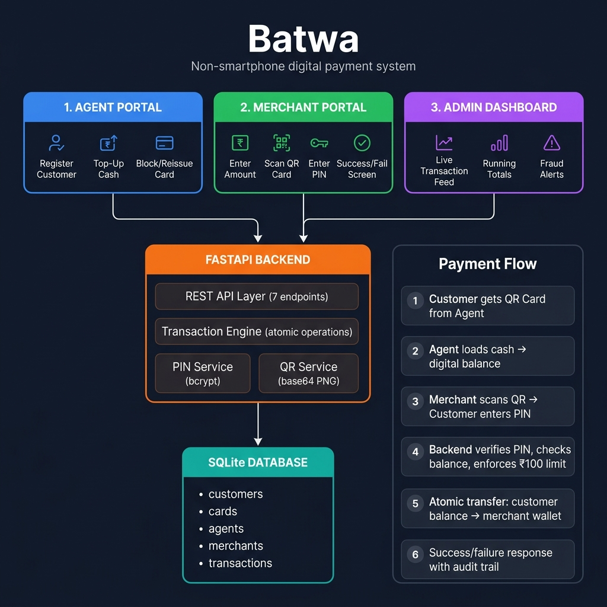

# Batwa 💳

**Non-Smartphone Digital Payment System** — Cognizant NPN Nurture Program Hackathon

> Let people without smartphones or bank accounts make small digital payments using a simple printed QR card and a 4-digit PIN.

---

## The Problem

Millions of people in India — daily-wage workers, elderly citizens, rural residents — are excluded from digital payments because they don't own a smartphone or have a bank account. They're stuck with cash, missing out on the convenience and safety of digital transactions.

## Our Solution

**Batwa** (Hindi for "wallet") bridges this gap with a familiar 3-step flow:

1. **Get a Card** — Visit a local Agent shop, provide your name and phone, set a 4-digit PIN → receive a printed QR card
2. **Load Cash** — Hand cash to the Agent → it's loaded as digital balance on your card
3. **Pay at Shops** — Merchant scans your QR card → you enter your PIN → payment goes through instantly

No smartphone. No bank account. No app download. Just a card and a PIN.

---

## System Architecture



### Payment Flow

```
┌─────────────┐     ┌──────────────────┐     ┌─────────────────┐
│   CUSTOMER  │     │   AGENT PORTAL   │     │ MERCHANT PORTAL │
│  (QR Card)  │     │   (React App)    │     │   (React App)   │
└──────┬──────┘     └────────┬─────────┘     └────────┬────────┘
       │                     │                        │
       │  1. Registers at    │                        │
       │     agent shop      │                        │
       │────────────────────>│                        │
       │                     │  2. POST /register     │
       │  3. Gets QR card    │───────────────┐        │
       │<────────────────────│               │        │
       │                     │  4. POST      │        │
       │  5. Hands over cash │    /topup     │        │
       │────────────────────>│──────────┐    │        │
       │                     │          │    │        │
       │  6. Balance loaded  │          ▼    ▼        │
       │<────────────────────│    ┌───────────────┐   │
       │                     │    │   FASTAPI     │   │
       │                     │    │   BACKEND     │   │
       │  7. QR scanned      │    │               │   │
       │     at merchant     │    │ • PIN verify  │   │
       │─────────────────────┼───>│ • Balance chk │   │
       │                     │    │ • ₹100 limit  │   │
       │  8. Enters PIN      │    │ • Atomic txn  │   │
       │─────────────────────┼───>│ • Audit trail │<──│
       │                     │    │               │   │  9. POST /pay
       │  10. ✅ or ❌       │    └───────┬───────┘   │
       │<─────────────────────────────────┼──────────>│
       │                     │            │           │
       │                     │            ▼           │
       │                     │    ┌───────────────┐   │
       │                     │    │    SQLite DB   │   │
       │                     │    │               │   │
       │                     │    │ • customers   │   │
       │                     │    │ • cards       │   │
       │                     │    │ • agents      │   │
       │                     │    │ • merchants   │   │
       │                     │    │ • transactions│   │
       │                     │    └───────────────┘   │
       │                     │                        │
```

### Core Design Decisions

| Decision | What | Why |
|---|---|---|
| **Card ≠ Customer** | `customer_id` is permanent, `card_id` is reissuable | On reissue, customer keeps identity + balance + history. Only the card changes. |
| **Atomic Transactions** | Every topup/payment wrapped in `BEGIN IMMEDIATE` | Money is never "half-moved" — if any step fails, everything rolls back |
| **₹100 Limit** | Enforced on payments only, not topups | Blueprint requirement for payments; topups are agent-mediated cash deposits |
| **Audit Trail** | Every operation (including failures) recorded | Failed payments log the `failure_reason` — complete accountability |

---

## Tech Stack

| Layer | Technology | Status |
|---|---|---|
| **Backend** | FastAPI (Python 3.10+) | ✅ Complete |
| **Database** | SQLite (WAL mode, file-based) | ✅ Complete |
| **Frontend** | React + Vite | ✅ Agent + Merchant portals built |
| **QR Generation** | `qrcode` + Pillow → base64 PNG | ✅ Complete |
| **QR Scanning** | `html5-qrcode` in browser | ✅ Complete |
| **PIN Security** | bcrypt hashing | ✅ Complete |
| **i18n Framework** | React Context + copy map | 🔶 English done, HI/TA pending |
| **Voice Prompts** | Pre-recorded `.mp3` via `<audio>` | ❌ Not started |
| **Admin Dashboard** | React + `/transactions` API | ❌ Not started |
| **PDF Receipts** | `reportlab` | ❌ Not started |
| **Deployment** | Render (backend) + Vercel (frontend) | ❌ Not started |

---

## Project Structure

```
Batwa/
├── backend/
│   ├── main.py                  # FastAPI app (CORS, lifespan, routes)
│   ├── database.py              # SQLite schema, WAL mode, atomic txns
│   ├── models.py                # Pydantic request/response models
│   ├── seed.py                  # Test data seeder
│   ├── test_endpoints.py        # Integration tests (36/36 passing)
│   ├── requirements.txt         # Python deps
│   ├── routes/
│   │   ├── customers.py         # POST /customers/register
│   │   ├── wallet.py            # POST /wallet/topup, /wallet/pay, GET /wallet/balance
│   │   ├── cards.py             # POST /cards/block, /cards/reissue
│   │   └── transactions.py     # GET /transactions
│   └── services/
│       ├── pin_service.py       # bcrypt PIN hash & verify
│       ├── qr_service.py        # QR code → base64 PNG
│       └── txn_service.py       # Atomic transaction engine
│
├── frontend/agent-portal/
│   ├── src/
│   │   ├── App.jsx              # Router: /, /agent/*, /merchant/*
│   │   ├── api/
│   │   │   ├── agentApi.js      # Backend calls for agent ops
│   │   │   └── merchantApi.js   # Backend calls for payments
│   │   ├── pages/
│   │   │   ├── LandingPage.jsx  # Portal selection (Agent / Merchant)
│   │   │   ├── AgentHome.jsx    # Agent dashboard
│   │   │   ├── RegisterCustomer.jsx  # Registration form + QR display
│   │   │   ├── TopUp.jsx        # Cash → digital balance
│   │   │   ├── BlockReissue.jsx # Card management
│   │   │   ├── MerchantPortal.jsx    # Full 4-step payment flow
│   │   │   └── MerchantSetup.jsx     # Merchant ID config
│   │   ├── components/
│   │   │   ├── qr/QrScanner.jsx      # Camera QR scan + manual entry
│   │   │   └── ui/              # Button, FormField, NumericKeypad, etc.
│   │   ├── i18n/                # Language context + EN copy
│   │   ├── merchant/            # Payment flow state machine
│   │   ├── config/              # Runtime config, demo mode
│   │   └── styles/              # CSS (global, tokens, ui)
│   └── tests/                   # merchantFlow, merchantApi, merchantDemo
│
├── docs/
│   └── architecture.png         # System architecture diagram
├── MEMORY.md                    # Living project memory (decisions, progress)
├── .gitignore
└── README.md
```

---

## Quick Start

### Backend

```bash
cd backend
pip install -r requirements.txt
python seed.py                              # Seed test data
python -m uvicorn main:app --reload         # http://localhost:8000
```

**API docs:** http://localhost:8000/docs

### Frontend

```bash
cd frontend/agent-portal
npm install
npm run dev                                 # http://localhost:5173
```

### Test Data (from seed.py)

| Type | IDs | Details |
|---|---|---|
| Agents | `AGT-001`, `AGT-002` | Float: ₹10,000 each |
| Merchants | `MER-001`, `MER-002` | Balance: ₹0 |
| Customers | `CUST-TEST01` – `CUST-TEST05` | PIN: `1234`, Balance: ₹0 |
| Cards | `CARD-TEST01` – `CARD-TEST05` | Status: active |

---

## API Endpoints

| Method | Endpoint | Description |
|---|---|---|
| `POST` | `/customers/register` | Register customer → returns `customer_id`, `card_id`, QR code |
| `POST` | `/wallet/topup` | Agent loads cash → customer balance (requires `agent_id`, `card_id`, `amount`) |
| `POST` | `/wallet/pay` | Merchant payment → verifies PIN, enforces ₹100 limit, atomic transfer |
| `GET` | `/wallet/balance/{customer_id}` | Check customer balance and card status |
| `POST` | `/cards/block` | Block a card (requires `card_id`) |
| `POST` | `/cards/reissue` | Block old cards, issue new card, carry over balance (requires `customer_id`) |
| `GET` | `/transactions` | Filterable transaction history (`?customer_id=`, `?agent_id=`, `?merchant_id=`) |

### Failure Reasons (closed set)

| Code | Meaning |
|---|---|
| `WRONG_PIN` | PIN verification failed |
| `INSUFFICIENT_BALANCE` | Not enough balance for this payment |
| `BLOCKED_CARD` | Card has been blocked |
| `LIMIT_EXCEEDED` | Payment exceeds ₹100 per-transaction limit |
| `AGENT_FLOAT_INSUFFICIENT` | Agent doesn't have enough float for topup |
| `CARD_NOT_FOUND` | Card ID doesn't exist |
| `MERCHANT_NOT_FOUND` | Merchant ID doesn't exist |

---

## Current Progress

| Component | Owner | Status | Notes |
|---|---|---|---|
| Backend (all 7 endpoints) | Harsh | ✅ **Complete** | 36/36 integration tests passing |
| Agent Portal | Pratik | ✅ **Complete** | Register, topup, block/reissue — all wired |
| Merchant Portal | Pratik | ✅ **Complete** | 4-step flow: amount → QR scan → PIN → result |
| Landing Page | Pratik | ✅ **Complete** | Portal selection with branding |
| UI Components | Pratik | ✅ **Complete** | Button, NumericKeypad, FormField, QrScanner, etc. |
| i18n Framework | Pratik | 🔶 Partial | English done, Hindi/Tamil translations needed |
| Admin Dashboard | Ruchir | ❌ Not started | Live transaction feed + totals |
| Voice Prompts | Ruchir | ❌ Not started | Audio clips per language |
| Receipt Generation | Atharva | ❌ Not started | PDF or print view |
| Deployment | Atharva | ❌ Not started | Render + Vercel |

---

## Running Tests

### Backend (with server running)
```bash
cd backend
python test_endpoints.py
# 36/36 checks — covers all endpoints + all failure paths
```

### Frontend
```bash
cd frontend/agent-portal
npx vitest run
# merchantFlow, merchantApi, merchantDemo tests
```

---

## Team

| Person | Role | Status |
|---|---|---|
| **Harsh** | Backend core — schema, transaction engine, PIN security, API endpoints | ✅ Core done |
| **Pratik** | Agent Portal + Merchant Portal frontend, UI components, API integration | ✅ Core done |
| **Krishna** | Merchant Portal support (Pratik built the initial version) | 🔶 Integration |
| **Ruchir** | Accessibility layer, language switching, voice prompts, Admin dashboard | ❌ Pending |
| **Atharva** | Receipt generation, deployment, additional QA | ❌ Pending |

---

## What's Remaining (Day 4–5)

### Critical for Demo
1. **Admin Dashboard** — live transaction feed from `GET /transactions`
2. **Hindi/Tamil translations** — fill in `copy.js` for HI and TA languages
3. **Voice prompts** — record/source `.mp3` clips, wire to `<audio>` elements
4. **Deployment** — backend on Render, frontend on Vercel

### Nice-to-Have
- Receipt PDF generation via `reportlab`
- QR camera scanning on Agent topup screen
- CORS origin lockdown (currently `*`)
- Fraud detection flag on Admin dashboard

---

## License

Hackathon project — Cognizant NPN Nurture Program.