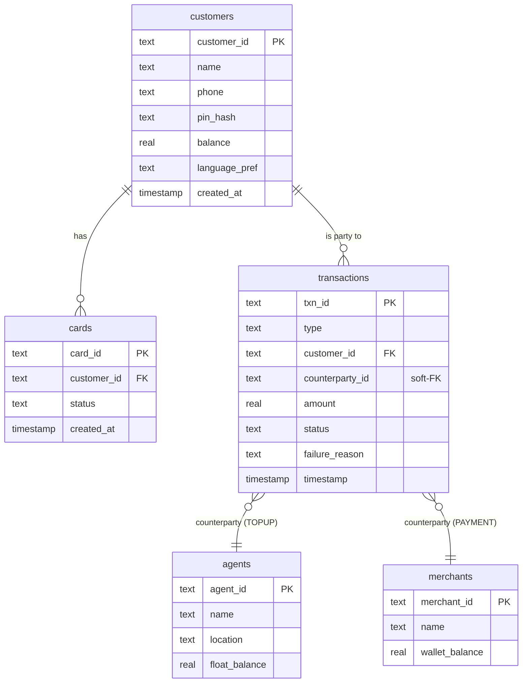

# Batwa — Database Schema

**Source of truth:** `backend/database.py` → `SCHEMA_SQL`.
**Keep in sync:** run `python scripts/schema_check.py` (CI-enforced) to verify this
diagram still matches the actual DDL. If you change a table, change BOTH.

## ER Diagram

## Notes

- **`customers ↔ cards`** — identity/card separation (FR-3). A reissue inserts a new
  `cards` row; `customer_id` never changes, so transaction history survives reissue.
- **`transactions.counterparty_id` is a *soft* foreign key** — it holds an `agent_id`
  when `type='TOPUP'` and a `merchant_id` when `type='PAYMENT'`, but SQLite cannot
  enforce a FK that targets two tables, so the schema has **no** `REFERENCES` clause
  on it. Referential integrity for the counterparty is guaranteed only by the
  transaction engine (`backend/services/txn_service.py`), not the database. This is
  intentional for v1.
- **Failure tracking** — `status` + `failure_reason` record every attempt, including
  failures, per NFR-3. `failure_reason` is drawn from the closed set in PRD §6.4.
- **`pin_hash`** — bcrypt hash only, never returned by any API (NFR-2).
